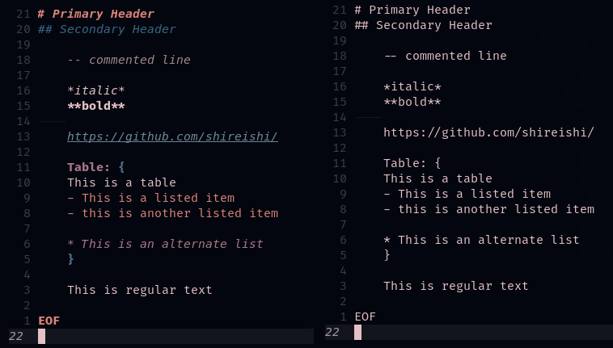

# CustomHighlighting.nvim
Note: This project is in the earliest of stages. Modular systems are virtually non-existent, but there are plans for them in the future.

This Custom Highlighting plugin for Neovim works with vim-plug, but I haven't tested
it out for any other neovim plugin manager. 



## Insallation
To install this plugin, simply clone the git repository into your plugin folder and add
```vim
Plug 'shireishi/CustomHighlighting.nvim'
```
to your init.vim or
```lua
require'highlight'.start()
```
to your lua section/file.

## Furher Workings
If you are using a plugin that manages files, like Nvim-tree, then I would recommend you add the line
```lua
require'highlight'.start()
```
to line 397 of lib.lua within the nvim-tree.lua/lua/nvim-tree/ directory.


## TODO
- [ ] Setup dashboard-nvim with the plugin to make it work
- [ ] Incorporate an init.vim global settings section to make the system easier to customize
- [ ] Set up a more modular filetype system

